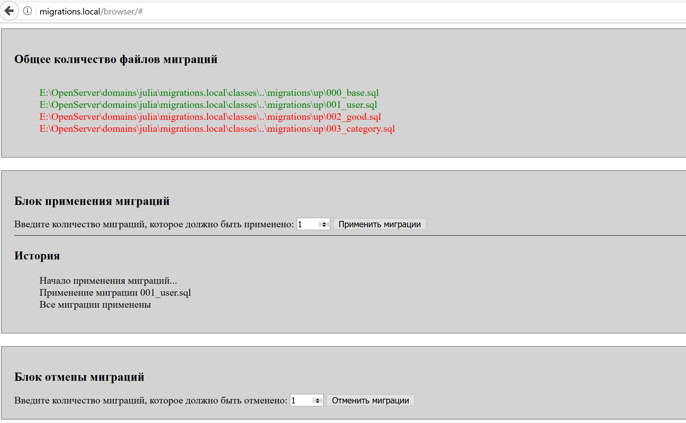

# Система для работы с миграциями
Система позволяет веб-разработчику создавать структуру базы данных посредством ряда sql-файлов, а также изменять структуру таблиц и откатывать изменения посредством группы sql файлов.
SQL файлы находятся в 2-х папках:
+ migrations/up - файлы, которые применяются к базе данных при выполнении миграций;
+ migrations/down - файлы, код которых отменяет то, что у нас создано, при применении аналогичных файлов из папки up.

## Системные требования
+ PHP 5.3+
+ СУБД MySQL

## Преимущества системы
Система миграций позволяет веб-разработчику отказаться от создания структуры базы данных напрямую (через SQL или дамп базы данных).
Теперь структура разбита на множество файлов, которые можно применять и отменять за считанные секунды посредством 2-х интерфейсов (консоль и графический клиент).

Команды посредством данной системы увеличивают скорость разработки ПО и могут использовать специализированные хранилища (в т.ч. Git) для сохранения структуры базы данных.

Подобные системы миграций содержат многие современные PHP-фреймворки.

## Работа из консоли
Для того, чтобы работать с системой миграций из консоли:
+ Выполните шаги из п. "Подготовка к работе";
+ Перейдите в каталог console. 
Выполните нужную Вам команду.

### Примеры консольных команд
+ php index.php up - применение всех миграций;
+ php index.php down - отмена миграций;
+ php index.php up 3 - применение 3-х ближайших миграций;
+ php index.php down 3 - отмена 3-х последних миграций.

## Работа из графического клиента
Откройте в браузере страницу /browser/index.php.
Вы увидете 3 секции:
1. Общее количество файлов миграций. Зеленым выделены уже примененные миграции, красным - не примененные;
2. Блок применения миграций;
3. Блок отмены миграций.

## Подготовка к работе
+ Скачайте систему миграций;
+ Настройте параметры подключения к базе данных (см. следующий подраздел);
+ Проверьте, установлен ли у Вас интерпретатор php, для этого в консоли выполните команду php -v.
Вы увидете версию php, если все в порядке, или сообщение об ошибке;
+ Проверьте, установлена ли СУБД MySQL и работает ли команда mysql в консоли. При отсутствии данной команды установите СУБД mySQL.

Если Вы используете веб-сервер, php установлен внутри него (например, OpenServer), то необходимо прописать путь к интерпретатору в переменных среды, чтобы команда php стала доступна из консоли.

## Настройка параметров подключения к базе данных
Настройки подключения прописаны в файле classes/Migrate.php.
Измените их на свои.

+ protected $host = 'localhost' - имя хоста, где размещена база данных, по умолчанию "localhost";
+ protected $user = 'phpmigrations' - имя пользователя базы данных, по умолчанию "phpmigrations";
+ protected $password = 'phpmigrations' - пароль пользователя, по умолчанию "phpmigrations";
+ protected $dbName = 'phpmigrations' - имя базы данных, по умолчанию "phpmigrations";
+ protected $port = 3306 - номер порта, по умолчанию "3306".